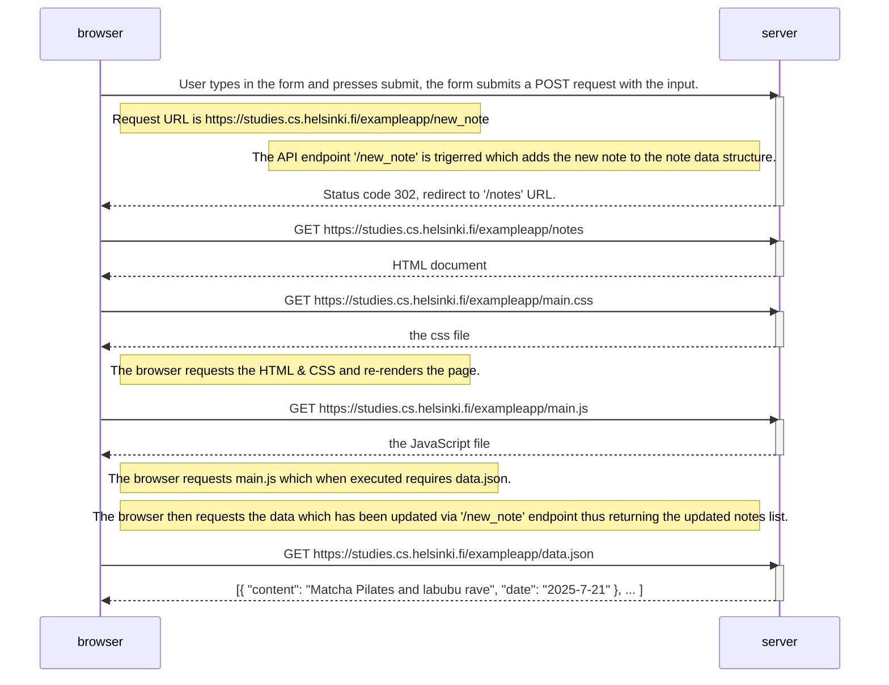

```mermaid

sequenceDiagram
    participant browser
    participant server

    browser->>server: User types in the form and presses submit, the form submits a POST request with the input.
    activate server
    Note right of browser: Request URL is https://studies.cs.helsinki.fi/exampleapp/new_note
    Note left of server: The API endpoint '/new_note' is trigerred which adds the new note to the note data structure. 
   
    server-->>browser: Status code 302, redirect to '/notes' URL.
    deactivate server
	  

    browser->>server: GET https://studies.cs.helsinki.fi/exampleapp/notes
    activate server
    server-->>browser: HTML document
    deactivate server

    browser->>server: GET https://studies.cs.helsinki.fi/exampleapp/main.css
    activate server
    server-->>browser: the css file
    deactivate server
	Note right of browser: The browser requests the HTML & CSS and re-renders the page.
	
    browser->>server: GET https://studies.cs.helsinki.fi/exampleapp/main.js
    activate server
    server-->>browser: the JavaScript file
    deactivate server

	Note right of browser: The browser requests main.js which when executed requires data.json.
	Note right of browser: The browser then requests the data which has been updated via '/new_note' endpoint thus returning the updated notes list.
    browser->>server: GET https://studies.cs.helsinki.fi/exampleapp/data.json
    activate server
    server-->>browser: [{ "content": "Matcha Pilates and labubu rave", "date": "2025-7-21" }, ... ]
    deactivate server

   
```
 

